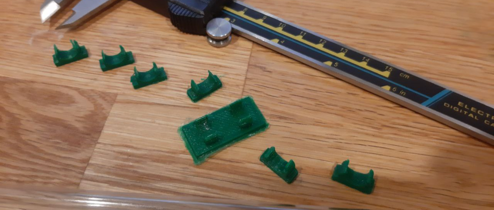

# Straw Maker v2

A few years ago I designed straw markers for the typical singel-use plastic straws. This helped to minimize waste because everybody used a single straw for a whole evening. With the banning of single-use plastics I had to redesign my markers for reusable straws.

After testing some different approaches, like rubber bands for the mounting, I settled on a simple cicking system to mount the markers to the straw.

_(The clip prototyping)_

It took me seven tries to find the optimal dimensions for the mounting ring. It has to tightly snap into place without risking breakage of the plastic. It also has to be able to do this repeatately.

_(The vision)_

In the end I printed 77 markers in 7 different colors. Each color figure combination is unique.

## Sources of the 2D figures

All of those models were modified in order to be used for this project.

1. Rebels Logo: https://www.printables.com/de/model/65546-star-wars-rebel-logo
1. Unicorn: https://www.printables.com/de/model/137490-beads-animals-owl-unicorn-butterfly-flamingo
1. Cauldron / Owl: https://www.thingiverse.com/thing:32008
1. Elephant / Hedgehog: https://www.thingiverse.com/thing:31313
1. Charmander: https://www.thingiverse.com/thing:2782251
1. Gear: https://www.printables.com/de/model/122632-10-vintage-gear-buttons
1. Ghost: https://www.thingiverse.com/thing:1834102
1. Star / Leaf: https://www.printables.com/de/model/122521-sewing-buttons-collection
